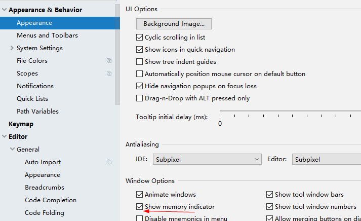
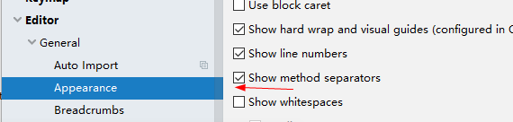
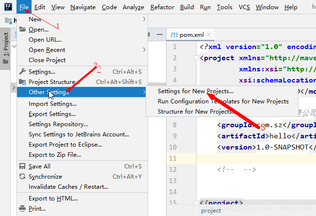
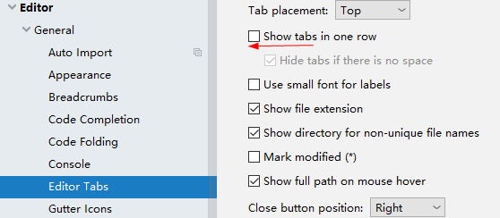
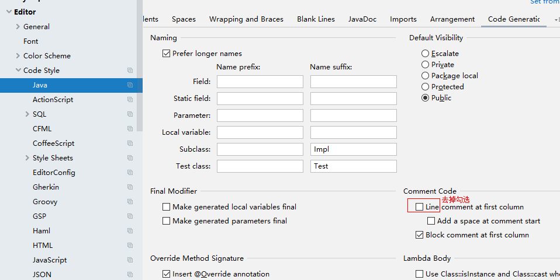
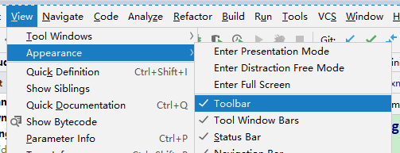
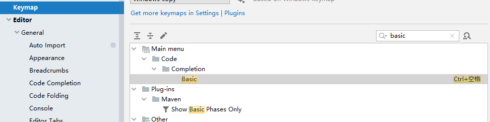

## 一些设置
1. 显示内存使用情况

   

2. 默认 IntelliJ IDEA 是没有勾选 Show method separators 显示方法线的，这种线有助于我们区分开方法，所以也是建议勾选上的

   

3. 默认设置，很多设置都是针对当前工程设置的，导致创建新工程不生效
    

4. IntelliJ IDEA 默认是把所有打开的文件名 Tab 单行显示的。但是我个人现在的习惯是使用多行，多行效率比单行高，因为单行会隐藏超过界面部分 Tab，这样找文件不方便。

   

   

5. 默认 IntelliJ IDEA 对于 Java 代码的单行注释是把注释的斜杠放在行数的最开头，我个人觉得这样的单行注释非常丑，整个代码风格很难看，所以一般会设置为单行注释的两个斜杠跟随在代码的头部。

   

6. 显示工具栏

   

   

7. 基础代码补全快捷键建议修改为ctrl+/，默认ctrl+空格是输入发快捷键，不能补全

   

   

## 更多设置参考

- <https://mp.weixin.qq.com/s?__biz=MzU1Nzg4NjgyMw==&mid=2247487073&idx=1&sn=6a3c6b393f262fa45d05347d8fc0976f&chksm=fc2fb269cb583b7f1f484e28615fc883e2f54fff27639a5a67d283f7b62b5886593d1869a236&mpshare=1&scene=24&srcid=1016IXPPu0aL2coEk8XU6YiS&sharer_sharetime=1602811485908&sharer_shareid=4608d8f44ae060d1a72636aef6ff7f06&key=6121756d4ad9fd3c156d00dcea32cab51334ce1062f4be0d297cb06bb755cdbad25ac2ed32eef8a7f9ceda200baf3269a854e9a98f0c0f1284fdfb7abd9315513286d5bf0fbddd611f7e093e63f686c3571461072bf3380e5d6a5590a5cd1ea38a39f51e7cbf60f4872082e880185378f21058a0686cbc1f56e5ef6b5b127e69&ascene=14&uin=MTM0MTg2NzYzNA%3D%3D&devicetype=Windows+10+x64&version=62090529&lang=zh_CN&exportkey=AVUCyualJvPGcPLM4cBLY3s%3D&pass_ticket=jW4zFD%2FTJJT5G444HfV24Aaya8c0fhKeXG4KCM7%2BuHxByCYH%2F6DGOOpFvv9vPYwN&wx_header=0>

## 快捷键
- Alt+7 打开structure视图，查看当前类方法
- Ctrl+F12可以快捷查看方法列表，不过默认字母顺序，每次都要重新设置顺序，麻烦
- Shift+Esc 关闭非代码视图
- Alt+1 打开Project视图
---
- 编辑器上方展示了当前文件的全目录，可以快速打开目录中的另一个文件
---
- Alt+Enter 快速修复错误
- Alt+Insert 生成代码
- Shift+F6 重构：修改类名、方法名、变量名
- Ctrl+Space / Ctrl+Shift+Space 补全代码
- Ctrl+Y 删除当前行/选中行
- Ctrl+D 复制当前行（选中行）到下方
- Ctrl+Z / Ctrl+Shift+Z 撤销/取消撤销
- Ctrl+F 当前文件搜索字符串
- Ctrl+R 当前文件替换
---
- Ctrl+Alt+S 打开设置
- Ctrl+Alt+Shift+S 打开项目设置
---
- Ctrl+N 打开类
- Ctrl+Shift+N 打开文件
- 双击Shift 搜索一切（可以路径缩写+文件名，比如no/info，可以搜到notify/info.jsp文件）
- Ctrl+Shift+F 所有/指定范围文件搜索字符串
---
- Ctrl+G 跳转到行
- Ctrl+Q 查看方法、变量说明(Quick Document)
- F2 / Shift+F2 高亮错误快速定位
- Ctrl+W 选择代码，多按几下试试
- Ctrl+Alt+左/右方向 在当前文件跳转到前一次编辑的位置
- Alt+左/右方向 跳转到上一个文件编辑位置

### 减少用鼠标：
- 多用PageUP/PageDown键来翻页
- Ctrl+上下方向，一行一行滚动屏幕，光标位置不变
- Ctrl+Home/End 跳转到文件开头/结尾
- Home/End 跳转到行开头和结尾
---
- Ctrl+E 最近的文件/视图列表
---
- Ctrl+Shift+U 大写小写转换
---
- Ctrl+Shift+F9 重新编译当前类，可以热部署
- Ctrl+F9 重新编译整个工程
---
- Ctrl+Shift+M 在代码块的开始或结束之间切换，请按 
- Ctrl + (-/+) 收起或者展开一段代码块（比如，一块注释或者一个方法太长，可以按Ctrl + - 将它收起来）
- Ctrl + F4 关闭当前文件
