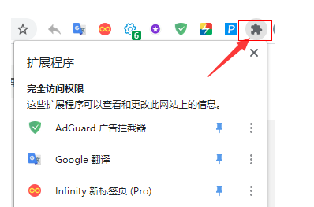

## chrome更新后会自动隐藏插件图标和调整图标位置-怎样关闭
用插件打开关闭或批量切换插件集合时，插件总是会被隐藏，还要手动去置顶新打开的插件，很麻烦，所以想关闭这个折叠插件图标的功能。

## 方法

对于Chrome浏览器上突然冒出来的按钮感到不适应，如果你想禁用这个按钮，可以参照以下方法：

在地址栏中输入chrome://flags/#extensions-toolbar-menu

然后选择【Disabled】将该选项禁用即可。

https://www.extfans.com/articles/1187