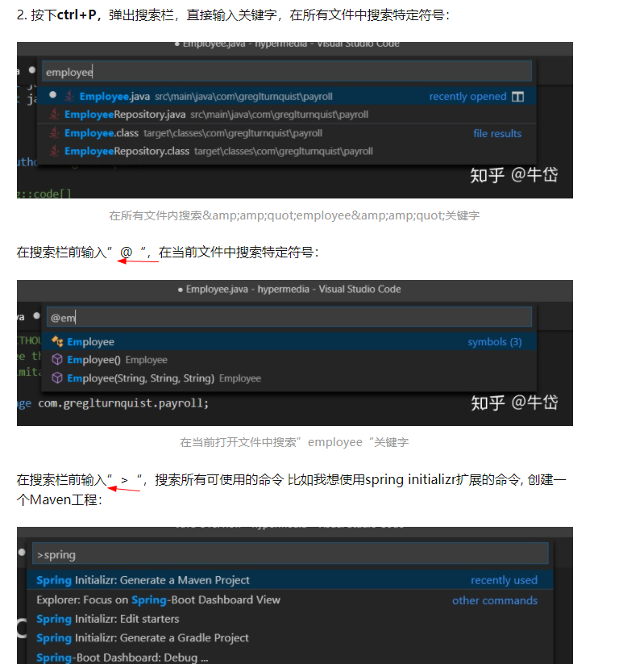

## 部分快捷键

- 删除当前行 ctrl+shift+k
- 剪切(当前行) ctrl+x
- 选中一个单词 ctrl+d
- 选中一行 ctrl+i
- 替换 ctrl+h
- 在文件中查找 ctrl+shift+f
- 在文件中替换 ctrl+shift+h
- 全部保存 ctrl+k s
---
- **打开快捷键设置 ctrl+k ctrl+s**
- [vscode快捷键官方表](https://code.visualstudio.com/shortcuts/keyboard-shortcuts-windows.pdf)
- 或者F1、输入shortcuts、回车  vscode快捷键官方表
---
- 快速打开文件(可加目录、可模糊) ctrl+p
- 打开命令面板 ctrl+shift+p
- 隐藏/打开侧边栏 ctrl+b 

---

## 其它
1. ctrl+p  @ >

   
   
## 参考

https://zhuanlan.zhihu.com/p/54164612

   