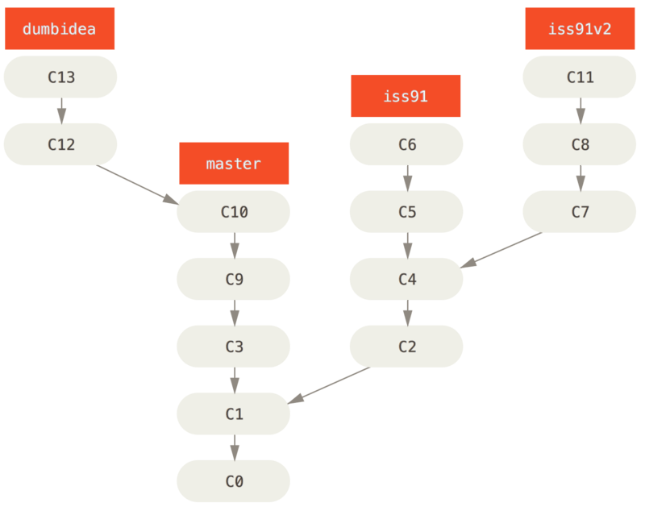

## 1. 多分支工作
- 参考<https://git-scm.com/book/zh/v2/Git-%E5%88%86%E6%94%AF-%E5%88%86%E6%94%AF%E5%BC%80%E5%8F%91%E5%B7%A5%E4%BD%9C%E6%B5%81>
- 多分支要实现如下效果
> 
- 在仓库t的test-branches.md文件实践，效果如下：
> 
- 合并后要达到如下效果，我分别在仓库t的master2和master3分支做实验，如下
> 

> 