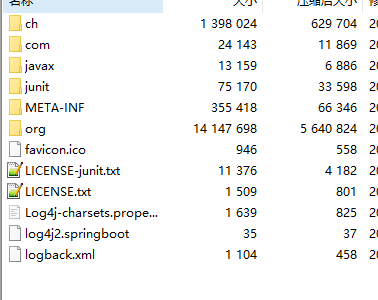
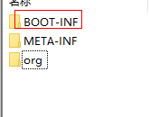
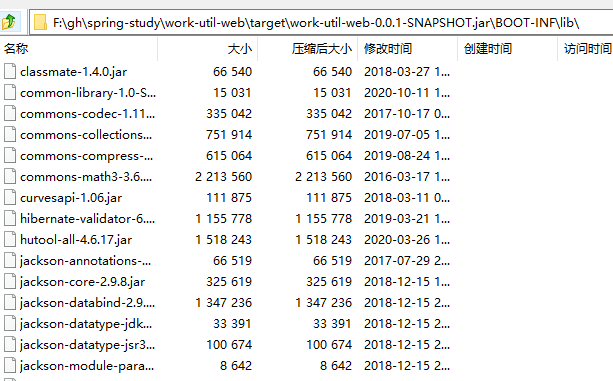

META-INF\MANIFEST.MF 是清单文件，配置运行主类等

```
Manifest-Version: 1.0
Created-By: 11.0.8 (Oracle Corporation)
Main-Class: Hello

```


### 使用maven插件maven-assembly-plugin

```xml
<!-- 打包时把依赖的jar也打入，但是这个是把jar的class打包进去了，和spring boot的打包打jar不一样 -->
            <plugin>
                <artifactId>maven-assembly-plugin</artifactId>
                <configuration>
                    <descriptorRefs>
                        <descriptorRef>jar-with-dependencies</descriptorRef>
                    </descriptorRefs>
                    <archive>
                        <manifest>
                            <mainClass>com.bkunzh.javastudy.log.LogTest</mainClass>
                        </manifest>
                    </archive>
                </configuration>
                <executions>
                    <execution>
                        <id>make-assembly</id>
                        <phase>package</phase>
                        <goals>
                            <goal>single</goal>
                        </goals>
                    </execution>
                </executions>
            </plugin>
```

打包之后的jar目录结构如下



和spring boot项目打包的结构不一样





