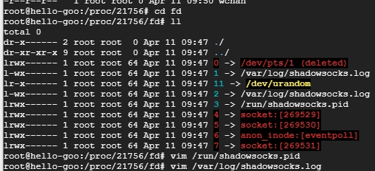

## 使用
通过ps及top命令查看进程信息时，只能查到相对路径，查不到的进程的详细信息，如绝对路径等.Linux在启动一个进程时，系统会在/proc下创建一个以PID命名的文件夹，在该文件夹下会有我们的进程的信息  
- cd /proc/[PID]
```
cwd符号链接的是进程运行目录；
exe符号连接就是执行程序的绝对路径；
cmdline就是程序运行时输入的命令行命令；
environ记录了进程运行时的环境变量；
fd目录下是进程打开或使用的文件的符号连接。日志目录
```

