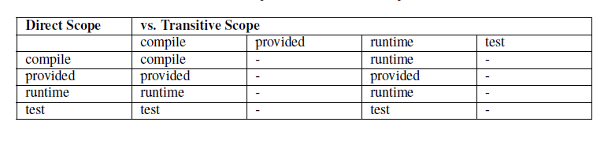

<!-- TOC -->

- [0. 要理解maven生命周期](#0-要理解maven生命周期)
- [1. mvn install](#1-mvn-install)
- [2. maven设置默认JDK版本](#2-maven设置默认jdk版本)
- [3. maven镜像](#3-maven镜像)
    - [3.1 在pom.xml指定maven仓库](#31-在pomxml指定maven仓库)
- [4. maven 聚合 继承](#4-maven-聚合-继承)
    - [4.0 继承和传递依赖](#40-继承和传递依赖)
        - [1) 继承](#1-继承)
        - [2) 依赖传递](#2-依赖传递)
            - [2.1) scope的依赖传递](#21-scope的依赖传递)
    - [4.1 聚合](#41-聚合)
    - [4.2 继承](#42-继承)
    - [4.3 总结](#43-总结)
    - [4.4 参考](#44-参考)
- [5. maven命令](#5-maven命令)
- [6. maven的全局setting.xml和项目pom.xml的优先级](#6-maven的全局settingxml和项目pomxml的优先级)

<!-- /TOC -->
## 0. 要理解maven生命周期
3个生命周期，clean、default（validate、resource、compile、test-resource、test-compile、test、package、install、deploy）、site。3个生命周期互不影响，但默认生命周期后面的阶段（parse）依赖前端阶段，执行后面的phase会先依次执行当前生命周期前面的phase。另外，常用的phase是绑定了默认的插件来完成构建工作的，自己的插件也可以绑定在phase上。  
> 工具类的东西理解原理，用的时候搜索就可以。不需要想着又是一个很大的技术，需要怎样怎样学习，买一本书看，关键知道这个技术能用来干嘛，需要时学习就好。不要畏惧一个技术
## 1. mvn install 
有些中央仓库没有的jar包，maven会报错，所以要把jar包安装到本地仓库，如下
	- 1）通过cmd输入命令
		mvn install:install-file -Dfile=memcached-2.6.6.jar -DgroupId=com.danga -DartifactId=memcached -Dversion=2.6.6 -Dpackaging=jar
		（如果jar包当前目录有pom.xml，会读取它，可能会报错，可以把jar包复制到空目录，再执行命令）
	- 2）通过eclipse：import->install or deploy an artifact to a Maven repository->找到jar包位置，输入groupId、artifactId、version
	
## 2. maven设置默认JDK版本
`settings.xml的<profiles>元素下`设置
```xml
    <profile>
      <id>development</id>
      <activation>
        <jdk>1.8</jdk>
        <activeByDefault>true</activeByDefault>
      </activation>
      <properties>
        <maven.compiler.source>1.8</maven.compiler.source>
        <maven.compiler.target>1.8</maven.compiler.target>
        <maven.compiler.compilerVersion>1.8</maven.compiler.compilerVersion>
      </properties>
    </profile>
```
或者在项目的pom.xml设置
```xml
<build>
        <plugins>
            <plugin>
                <groupId>org.apache.maven.plugins</groupId>
                <artifactId>maven-compiler-plugin</artifactId>
                <configuration>
                    <debug>false</debug>
                    <source>1.8</source>
                    <target>1.8</target>
                </configuration>
            </plugin>
        </plugins>
    </build>
```
## 3. maven多仓库，之前配置多个镜像是没有用的，镜像是拦截指定仓库的。可以配置多个profile，激活指定的
settings.xml
```XML
    <profiles>
    <profile> 
	  <id>profile1</id>  
	  <repositories> 
	    <repository> 
	     <id>alimaven</id>
		 <url>https://maven.aliyun.com/nexus/content/groups/public/</url>
	      <releases> 
	        <enabled>true</enabled> 
	      </releases>  
	      <snapshots> 
	        <enabled>true</enabled>  
	        <updatePolicy>always</updatePolicy> 
	      </snapshots> 
	    </repository> 
		<!--<repository> 
	     <id>aaacentral_repo2</id>
		 <url>https://repo1.maven.org/maven2/</url>
	      <releases> 
	        <enabled>true</enabled> 
	      </releases>  
	      <snapshots> 
	        <enabled>true</enabled>  
	        <updatePolicy>always</updatePolicy> 
	      </snapshots> 
	    </repository> -->
		<repository> 
	     <id>central_repo1</id>
		 <url>https://repo.maven.apache.org/maven2/</url>
	      <releases> 
	        <enabled>true</enabled> 
	      </releases>  
	      <snapshots> 
	        <enabled>true</enabled>  
	        <updatePolicy>always</updatePolicy> 
	      </snapshots> 
	    </repository> 
		
	  </repositories> 
	</profile> 
	<profile> 
	  <id>profile2</id>  
	  <repositories>
	  <repository> 
		 <id>spring-repo</id>
		 <url>https://repo.spring.io/release</url>
		 <releases> 
	        <enabled>true</enabled> 
	      </releases>  
	      <snapshots> 
	        <enabled>true</enabled>  
	        <updatePolicy>always</updatePolicy> 
	      </snapshots> 
	    </repository> 
	  <repository> 
		 <id>spring-snapshot</id>
		 <url>https://repo.spring.io/snapshot</url>
		 <releases> 
	        <enabled>true</enabled> 
	      </releases>  
	      <snapshots> 
	        <enabled>true</enabled>  
	        <updatePolicy>always</updatePolicy> 
	      </snapshots> 
	    </repository> 
	    <repository> 
	     <id>central_repo33</id>
		 <url>https://repo1.maven.org/maven2/</url>
	      <releases> 
	        <enabled>true</enabled> 
	      </releases>  
	      <snapshots> 
	        <enabled>true</enabled>  
	        <updatePolicy>always</updatePolicy> 
	      </snapshots> 
	    </repository> 
	  </repositories> 
	</profile>  
	<profile> 
	  <id>prfile3</id>  
	  <repositories> 
	    <repository> 
	      <id>maven-central</id>  
	      <url>https://central.maven.org/maven2/</url>  
	      <releases> 
	        <enabled>true</enabled> 
	      </releases>  
	      <snapshots> 
	        <enabled>true</enabled>  
	        <updatePolicy>always</updatePolicy> 
	      </snapshots> 
	    </repository> 
	  </repositories> 
	</profile> 
	
  </profiles>
  
   <activeProfiles>
    <!-- 激活-->
    <activeProfile>profile1</activeProfile>
    <activeProfile>profile2</activeProfile>
  </activeProfiles>
```
### 3.1 在pom.xml指定maven仓库
```xml
<repositories>
<repository>
    <id>spring-repo</id>
    <name>Spring Repository</name>
    <url>https://repo.spring.io/release</url>
</repository>
<repository>
    <id>spring-milestone</id>
    <name>Spring Milestone Repository</name>
    <url>https://repo.spring.io/milestone</url>
</repository>
<repository>
    <id>spring-snapshot</id>
    <name>Spring Snapshot Repository</name>
    <url>https://repo.spring.io/snapshot</url>
    <snapshots>
        <enabled>true</enabled>
    </snapshots>
</repository>
</repositories>
```

## 4. maven 聚合 继承
聚合主要为了快速构建项目，继承主要为了消除重复。不一定需要一起使用，可以单独使用聚合，也可以结合使用。

### 4.0 继承和传递依赖
#### 1) 继承
> 子项目父项目中的依赖  
比如说我们有一个父项目maven-parent，该父项目拥有一个子项目A，如果在父项目中依赖了junit，那么在子项目A中即便是没有引入junit，在子项目中仍然能够使用junit，因为子项目天然继承了父项目中的junit依赖。
#### 2) 依赖传递
> 在Maven中，依赖是可以传递的
就是说假设存在三个项目，分别是项目A，项目B以及项目C，假设C依赖于B，B依赖于A，那么我们可以根据Maven项目依赖的特征不难推出项目C也依赖于A
##### 2.1) scope的依赖传递
A–>B–>C。当前项目为A，A依赖于B，B依赖于C。知道B在A项目中的scope，那么怎么知道C在A中的scope呢？答案是： 
当C是test或者provided时，C直接被丢弃，A不依赖C； 
如图：~~(竖向：c在b的scope，横向：b在a的scope)~~ 好像不是这样？？ 


### 4.1 聚合
> 把多个模块或项目聚合到一起，就能一次构建多个模块或项目。需要建立一个专门负责聚合工作的Maven项目（聚合项目）

1. 聚合项目的pom.xml如下
```xml
<?xml version="1.0" encoding="UTF-8"?>
<project xmlns="http://maven.apache.org/POM/4.0.0" xmlns:xsi="http://www.w3.org/2001/XMLSchema-instance"
         xsi:schemaLocation="http://maven.apache.org/POM/4.0.0 http://maven.apache.org/xsd/maven-4.0.0.xsd">
    <modelVersion>4.0.0</modelVersion>

    <groupId>com.bkunzhang</groupId>
    <artifactId>java-deep-study</artifactId>
    <version>0.1-SNAPSHOT</version>
	  <packaging>pom</packaging>

    <modules>
        <module>code/Java8-lambda</module>
        <module>code/problems</module>
    </modules>
</project>
```

- 聚合项目打包方式必须为： pom
- 引入了新元素modules、module
- modole的值为被聚合模块在当前聚合项目的相对目录

### 4.2 继承
继承是为了避免重复配置。

- 父项目打包方式必须为： pom
- 子项目继承配置
```xml
<parent>  
  <groupId>me.gacl.maven</groupId>
  <artifactId>Parent</artifactId>
  <version>0.0.1-SNAPSHOT</version>
  <!-- 使用相对路径 -->
  <relativePath>../pom.xml</relativePath>  
</parent>
```
- 子模块可以省略groupId和version，子模块将隐式的继承父模块的这两个元素
- 可被继承的POM元素

  - groupId:项目组ID,项目坐标的核心元素
  - version: 项目版本, 项目坐标的核心元素
  - properties: 自定义的maven属性
  - dependencies: 项目的依赖配置
  - dependencyManagement: 项目的依赖管理配置
  - repositories: 项目的仓库配置
  - build: 包括项目的源码目录配置、输出目录配置、插件配置、插件管理配置等
  - ...

> dependencyManagement元素：不会给parent引入依赖，也不会给它的子模块引入依赖，仅仅是它的配置是可继承的。子模块定义dependency时，只用声明groupId和artifactId，表示当前配置是继承于父POM的，version和dependencyManagement中声明的一样。

> pluginManagement这个元素和dependencyManagement相类似，它是用来进行插件管理的。

### 4.3 总结
继承和聚合不一定同时使用。没有继承关系，只有多个模块，可以只用聚合。当有继承关系，可以结合聚合，把多个项目统一管理，这时一般聚合项目就是父项目，其打包方式为pom，配置modules，在子项目中配置parent。

### 4.4 参考
- https://blog.csdn.net/wanghantong/article/details/36427411
- https://www.cnblogs.com/xdp-gacl/p/4058008.html

## 5. maven命令
- mvn clean
- mvn compile
- mvn package
- mvn install

## 6. maven的全局setting.xml和项目pom.xml的优先级
三者的级先是 pom.xml  > /home_dir/.m2/settings.xml > /maven_dir/conf/settings.xml 。  

