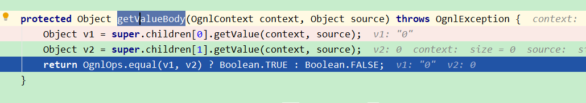
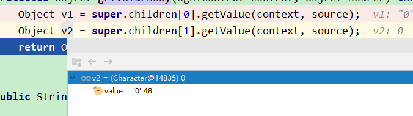
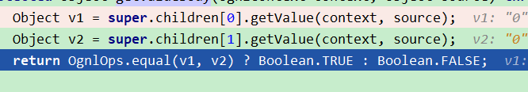
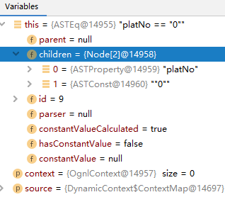

### if test string equals
<if test="s=='0'">不能比较s是不是字符串0（单个字符），ognl表达式中字符串可以用单/双引号包围（单字符除外）,可以用<if test='s=="0"'>，
或<if test="s=='0'.toString()"> 或者用java的equals方法，即!=用`<if test='!"0".equals(platNo)'>`替代，==用`<if test='"0".equals(platNo)'>`替代。

#### 1. 结合源码理解
源码见`org.apache.ibatis.scripting.xmltags.ExpressionEvaluator#evaluateBoolean`，打个断点就可以计算对应的ognl表达式了
```
OgnlCache.getValue("platNo == \"0\"", parameterObject)
OgnlCache.getValue("platNo == '0'", parameterObject)
```

在`org.apache.ibatis.ognl.ASTEq#getValueBody`中打断点:


1. platNo == '0'，一个是string，一个是char，所以不会相等.






2. platNo == '0'.toString()或platNo == "0"，都是string
   






#### 2. 参考代码
```xml
<if test='platNo != null and !"0".equals(platNo)'>
                and t.platNo = #{platNo}
            </if>
            <if test="platNo == '0'">
                and 1=1
            </if>
            <if test="platNo != '0'">
                and 2=2
            </if>
            <if test="platNo == '0'.toString()">
                and 3=3
            </if>
            <if test="platNo != '0'.toString()">
                and 4=4
            </if>
            <if test='platNo == "0"'>
                and 5=5
            </if>
            <if test='platNo != "0"'>
                and 6=6
            </if>
```

