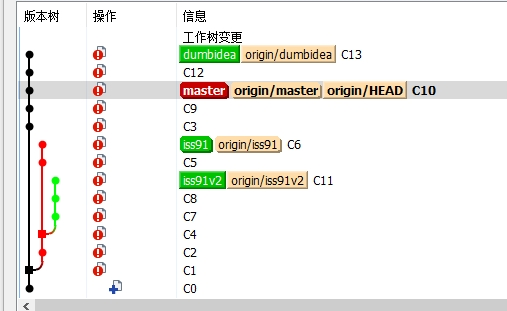
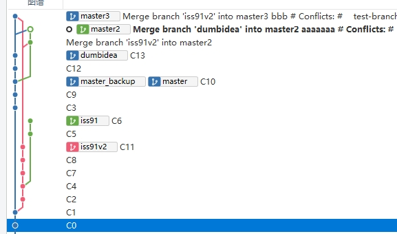

## 1. 多分支工作
- 参考<https://git-scm.com/book/zh/v2/Git-%E5%88%86%E6%94%AF-%E5%88%86%E6%94%AF%E5%BC%80%E5%8F%91%E5%B7%A5%E4%BD%9C%E6%B5%81>
- 多分支要实现如下效果
> 
- 在[仓库t](https://github.com/bkunzhang/t)的test-branches.md文件实践，效果如下：
> 
- 合并后要达到如下效果，我分别在[仓库t](https://github.com/bkunzhang/t)的master2和master3分支做实验，如下
> 

> 

## 2. git 进阶命令
git stash 暂存更改到栈，并还原工作区到最新提交的版本
> 很实用，还可以暂存某个文件
git reset
git revert 在多人合作的版本，如果已经push了，可以用这个命令还还原某次提交，它是增加一次提交，把提交的内容还原
git rebase

## 3. git忽略已经被提交的文件
git rm --cached logs/xx.log，然后更新 .gitignore 忽略掉目标文件，最后 git commit -m "We really don't want Git to track this anymore!"
